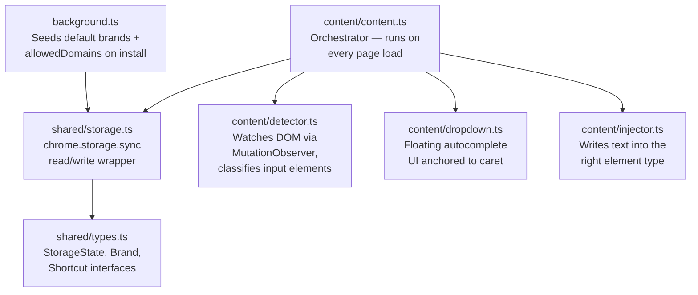
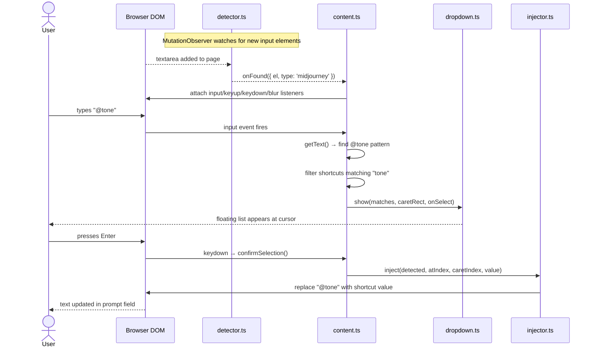
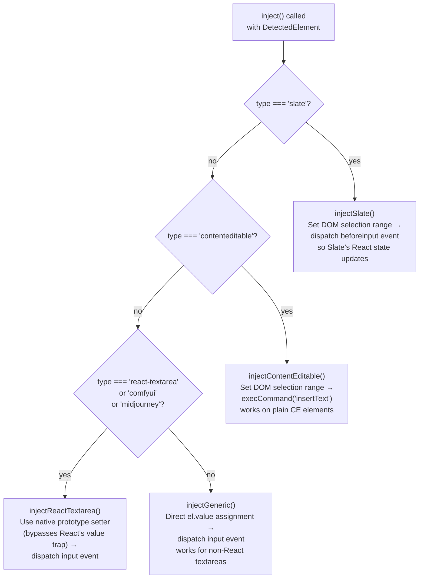

# BrandKey Architecture

## 1. Component Map

## 2. User Interaction Flow

What happens when you type `@tone` in a prompt field.

## 3. Injection Strategies

Different AI tools use different editor implementations — each needs a different injection approach.

> **Why the native setter trick?** React intercepts the `value` property on textarea elements, so direct `el.value = x` doesn't trigger a re-render. `Object.getOwnPropertyDescriptor(HTMLTextAreaElement.prototype, 'value').set` bypasses React's override and forces it to recognise the change.
