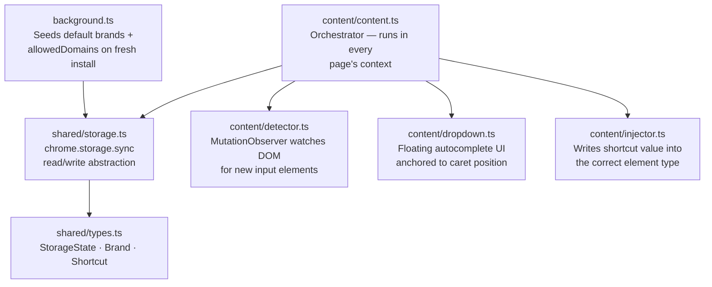
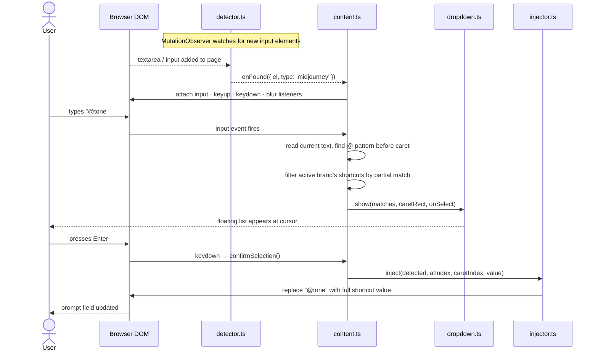
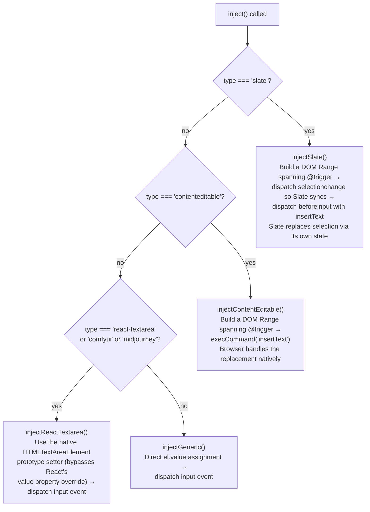
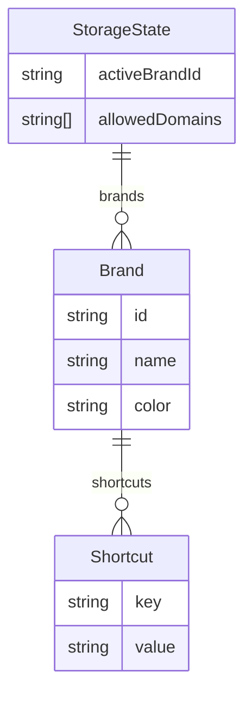

# BrandKey — How It Works

## What It Does

BrandKey is a Chrome extension that lets you store reusable brand context and inject it into any AI prompt field with a short `@key` trigger. The problem it solves: every time you open MidJourney, ComfyUI, or any other AI tool, you have to retype the same style, tone, and brand details. BrandKey makes those a one-keystroke insert.

### Core capabilities

**Key/value shortcut storage**
You define shortcuts as pairs — a short key and a full value. The key is what you type after `@`, the value is what gets inserted.

```
@tone     →  cinematic, minimal, editorial
@style    →  soft lighting, warm tones, 24mm lens, shallow depth of field
@primary  →  #FAFDA0
@mission  →  We create immersive brand worlds for forward-thinking companies.
```

Values can be anything: hex colours, long descriptive strings, technical parameters, copy fragments.

**Multiple brands**
You can store multiple brands and switch the active one. The active brand's shortcuts are what appear in the dropdown. This lets you work across different clients or projects without mixing contexts.

**Domain allowlist**
The extension only activates on domains you've added to the allowlist. It does nothing on sites you haven't explicitly permitted. Subdomains are covered automatically — adding `midjourney.com` also covers `www.midjourney.com`.

**Autocomplete dropdown**
When you type `@` anywhere in an allowed prompt field, a floating dropdown appears anchored to your cursor. It filters live as you type. Keyboard navigation (↑↓), Enter to insert, Esc to dismiss.

**Colour swatches**
If a shortcut value is a hex colour, the dropdown renders a colour swatch next to it for quick visual identification.

**Cross-device sync**
All data is stored in `chrome.storage.sync`, which syncs across Chrome profiles automatically. No account or server required.

---

## How It Works

### Overview



The extension has two main parts: the **background service worker** (`background.ts`), which runs once on install to seed default data, and the **content script** (`content/content.ts`), which is injected into every page and orchestrates everything at runtime.

---

### Step-by-step: what happens when you type `@tone`



**Domain check first.** When the content script loads it immediately checks `location.hostname` against the stored allowlist. If the current site isn't allowed, it exits — no observers, no listeners, no UI.

**Element detection.** `startDetector()` runs `querySelectorAll` once on the existing DOM, then sets up a `MutationObserver` to catch elements added dynamically (most AI tools load their editors after the initial page render). Every matched element fires an `onFound` callback exactly once — a `WeakSet` prevents duplicates.

**Classification.** Each detected element is tagged with a type based on what kind of editor it is:

| Type | What it is | How identified |
|------|-----------|----------------|
| `slate` | React Slate editor (e.g. older Claude.ai) | `data-slate-editor="true"` attribute |
| `react-textarea` | React-controlled textarea | Inside `.bg-panel` |
| `comfyui` | ComfyUI's canvas prompt | `data-capture-wheel` attribute |
| `midjourney` | MidJourney's prompt bar | `id="desktop_input_bar"` |
| `contenteditable` | Plain contenteditable div | `contentEditable === "true"` |
| `generic` | Standard input/textarea | Everything else |

**@ trigger detection.** On every `input` and `keyup` event, the handler reads the full text, finds the caret position, and looks for an `@word` pattern immediately before the caret using a regex (`/@([^\s@]*)$/`). If found, it filters shortcuts whose key starts with the partial match. If no matches, the dropdown hides.

**Dropdown positioning.** The dropdown is a single `<div>` injected into the page once and reused. Its position is calculated from the caret's `DOMRect` — it appears below the cursor by default, flips above if there isn't enough space below.

---

### Injection strategies

The hardest part of the extension. Different AI tools build their prompt editors differently, so a single `el.value = x` doesn't work everywhere.



**Why the native setter trick for React textareas?**
React replaces the native `value` setter on textarea elements with its own version that tracks internal state. If you do `el.value = x` directly, you're writing to React's property — React doesn't see it as a user-initiated change and won't re-render or update its internal state. The fix is to call the original native setter from `HTMLTextAreaElement.prototype`:

```typescript
const nativeSetter = Object.getOwnPropertyDescriptor(
  window.HTMLTextAreaElement.prototype, 'value'
)?.set
nativeSetter?.call(el, next)
el.dispatchEvent(new Event('input', { bubbles: true }))
```

This writes directly to the DOM property at the browser level, which React then observes via its synthetic `input` event listener and syncs into its state.

**Why `beforeinput` for Slate?**
Slate maintains its own internal document model separate from the DOM. Even if you manipulate the DOM directly, Slate will overwrite your changes on the next render. The only reliable way in is through Slate's own event handlers — dispatching a `beforeinput` event with `inputType: 'insertText'` triggers Slate's built-in text insertion logic, which updates both the DOM and Slate's internal state.

---

### Data model



Everything lives in `chrome.storage.sync` as a flat JSON object. The active brand is referenced by ID. Shortcuts belong to a brand. Allowed domains are a top-level list, not per-brand.

---

## Ideas for What's Next

**Per-domain active brand**
Right now the active brand applies everywhere. You might want `@tone` to resolve differently on MidJourney (image prompts) vs. ChatGPT (text copy). Mapping a brand to a domain would make this automatic.

**Prompt templates**
Multi-line prompts that reference multiple shortcuts inline, e.g.:
```
A @style photo with @tone mood. Brand colours: @primary and @secondary.
```
One trigger inserts the whole assembled prompt with all values resolved.

**Shortcut groups / nesting**
A `@brand` shortcut that expands to several values at once — essentially a macro that fires multiple shortcuts in sequence.

**Import / export**
JSON export of a full brand config so you can back it up, share it with a teammate, or version control it. Matching import with merge/overwrite options.

**Team sync**
Shared brand library via a lightweight backend (or even a shared Google Sheet / Notion page as a config source). Teammates pull the same shortcuts without manually copying them.

**Usage history**
Track which shortcuts you use most and surface them first in the dropdown, or show recently used shortcuts above alphabetically sorted ones.

**Broader platform support**
The injection infrastructure already handles most editor types. Extending to Runway, Kling, Pika, Adobe Firefly, or any new image/video model is mostly a matter of identifying the right selector and adding a classification rule.

**Shortcut preview on hover**
Hovering a shortcut in the dropdown could show the full value in a tooltip — useful for long values that get truncated in the dropdown list.
